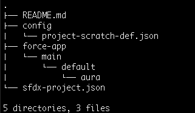
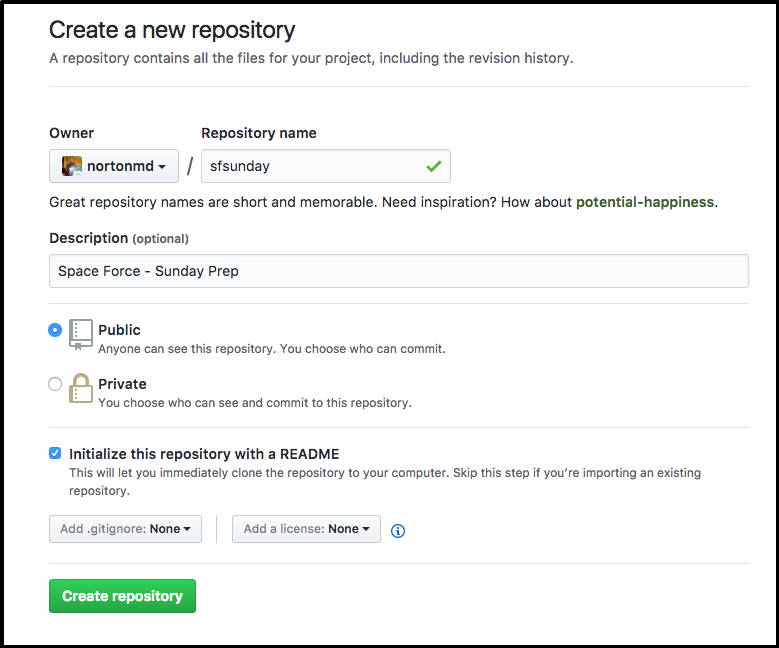
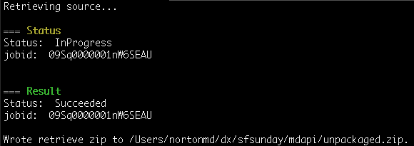
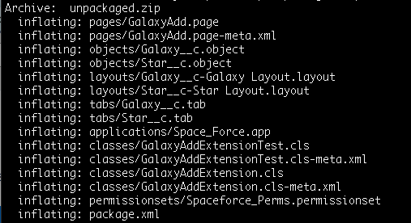
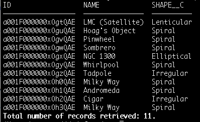
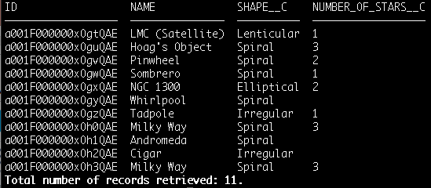
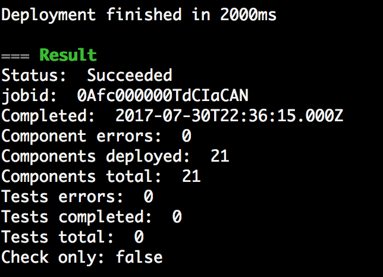

# Salesforce DX

#### Phoenix TrailheaDX Gathering - 8/3/2017

## Prerequisites
* [Download Salesforce DX](https://developer.salesforce.com/docs/atlas.en-us.208.0.sfdx_setup.meta/sfdx_setup/sfdx_setup_install_cli.htm)
* [Request a 30 Day DevHub Org](https://developer.salesforce.com/promotions/orgs/dx-signup)
* [Get a GitHub.com Account](https://github.com/)
* [DX Command Reference](https://github.com/nortonmd/dx-commands)

## Nice to have
* tree command - ```brew install tree```
* jq command - ```brew install jq```
* [SourceTree by Atlassian](https://confluence.atlassian.com/get-started-with-sourcetree/install-sourcetree-847359094.html)

## About DX commands
**Flags**

```
-d  Your DevHub Org
-a  Assign Org Alias
-u  Reference Org Alias
```

**Getting Help**

```
sfdx force:command --help
```

**DX-Commands Quick Reference** [link](https://github.com/nortonmd/dx-commands)

Nearly all sequetial.  Easy to search.  Drill down for each command.


## Let's Go

**Create a project**

```bash
$ cd workspace
$ sfdx force:project:create -n dxproject
$ cd dxproject
$ tree
```


Update the sfdx-project.json configuration file and change the *orgName* value to something else.  Example (Phoenix Salesforce Developers).

**Connect your DevHub Account**

```bash
$ sfdx force:auth:web:login -d -a DevHub 
```

**Connect your VCS**

Launch your browser to your GitHub.com account.  Create a repository for your DX project.  



Initialize your local repository and link it to your GitHub repo.

```
$ git init
$ echo ".sfdx/*" > .gitignore
$ git add .
$ git commit -m "Initial Commit"
$ git remote add origin https://github.com/nortonmd/dxdemo
$ git pull origin master
```

Note: There will be a conflict when mergine the README.md file.  Edit those file to resolve the conflicts, then ```git add``` & ```git commit``` the README.md.  Then push the project in this state to GitHub.

```
git add README.md
git commit -m "Resolve conflict on README.md"
git push origin master
```

Refresh your browser and checkout your repo in GitHub.

**Retrieve a package**

With DX, development work is separated into modules.  These modules are similar to packages or libraries in Java and C#.  This compartmentalization makes code management much simpler.

If your code is not already contained in packages, start creating packages with related components.

For the purpose of this demo I have already created a package in my *spaceforcedev* sandbox named ```spaceforcePkg``` with all of the components for my app.  In my package I have a permission set called ```Spaceforce Perms``` with access to the app, objects & fiels, and code components.

```
$ sfdx force:mdapi:retrieve -s -r ./mdapi -p spaceforcePkg -u spaceforcedev -w 10
```



This retrieves the components in the package from the sandbox ```spaceforcedev``` and places them into a zip file in the ```/mdapi``` folder.

Unzip the retrieve file and show the results.

```
$ cd mdapi
$ unzip unpacakged.zip
```



The zip file no longer serves a purpose and can be removed ```rm -f unpackaged.zip```

Push your components to GitHub.  *remember which directory you're in.*

```
$ git add .
$ git commit -m "Metadata Retrieved"
$ git push origin master
```

Check out your repo in GitHub.  Click into the mdapi/objects folder to open up one of the objects.  Note the blended XML in the .object file.  Files with blended metadata are nearly impossible to version.  

Convert the metadata format to the new DX format and push that code to GitHub.

```
$ sfdx force:mdapi:convert -r mdapi/
```


```
$ git add .
$ git commit -m "Components converted to DX format"
$ git push origin master
```

In GitHub, look at the force-app/main/default/objects folder.  Notice that each object is now a folder, and each of the categories of metadata is a folder, and each component is a new xml file.  Metadata stored in individual files are much easier to track in version control.

**Create a scratch org and deploy your code**

Create a scratch org, push the source, then assign the permission set to the default user (you).  NOTE: Scratch orgs take a little time to build, so grab a cup of coffee, or ask someone about their favorite movie.  

You'll know when your scratch org is ready when you get a response from ```$ sfdx force:org:open```

```
$ sfdx force:org:create -s -f config/project-scratch-def.json -a scratch1
$ sfdx force:source:push
$ sfdx force:user:permset:assign -n Spaceforce_Perms
```

Viola!  Application deployed into a scratch org.  Now let's load some data into it for our development.

**Export data from sandbox, then load it into the scratch org**

Salesforce DX comes with the abilty to query records, both to the screen and to files that can be used for importing into another org.

Export records from the ```spaceforcedev``` sandbox.  Then push them to GitHub.

```
$ sfdx force:data:tree:export 
       -u spaceforcedev 
       -q "SELECT Name, Shape__c, Size__c, (SELECT Name, Size__c, Type__c FROM Stars__r) 
             FROM Galaxy__c" -d ./data"
Wrote 27 records to data/Galaxy__c-Star__c.json
$ git add . && git commit -m "Saving Exported Data" && git push origin master
```

Check out the json file stored in the ./data folder in GitHub.

Import the records into the scratch org

```
$ sfdx force:data:tree:import --sobjecttreefiles data/Galaxy__c-Star__c.json
```

Open your scratch org and look at the data in the list views.  You can also query from the command line.

```
$ sfdx force:data:soql:query -q "select Id, Name, Shape__c from Galaxy__c"
```



**Pull Declarative Development into the project**

Open the scratch org and add a roll-up summary count field on Galaxy called "Number of Stars".  Pull the changed metadata into your source.  Push to GitHub.  NOTE: Profiles may have been updated, but we don't want them in our repo, so remove them, if necessary.

```
$ rm -rf mdapi/profiles
$ sfdx force:source:pull
$ git add . && git commit -m "Added Rollup on Galaxy to count Stars" && git push origin master
```


Requery and include the new field.

```
$ sfdx force:data:soql:query -q "select Id, Name, Shape__c, Number_of_Stars__c from Galaxy__c"
```



**Push to Sandbox**

Bundle up this app and push it to the DX System Integration Testing sandbox.  Authenticate to the DXSIT sandbox.

```
$ sfdx force:auth:web:login -a dxsit -r https://test.salesforce.com
```

Convert the DX format back to metadata format, commit and push to GitHub, deploy to the sandbox, then monitor the deployment.

```
$ sfdx force:source:convert -d mdapi/
$ git add . && git commit -m "Convert DX to Metadata format" && git push origin master
$ sfdx force:mdapi:deploy -d mdapi/ -u dxsit
```


Monitor the deployment

```
$ sfdx force:mdapi:deploy --job XXX --targetusername dxsit"  # Where XXX is the job id
```



**Get rocking into the sandbox**

Assign the permission set to the authenticated user in DXSIT

```
$ sfdx force:user:permset:assign -n Spaceforce_Perms
```

Load the data set into the DXSIT sandbox

```
$ sfdx force:data:tree:import --sobjecttreefiles data/Galaxy__c-Star__c.json
```

Run all tests, then monitor the results.

```
$ sfdx force:apex:test:run -u OrgAlias -d OutputDir
$ sfdx force:apex:test:report -u OrgAlias -i XXX  # Where XXX is the test job id
```

## Let's do it better

Script the commands you run routinely.  Add a ```bin``` directory and put the commands commands into bash scripts

```
$ mkdir bin
$ export PATH=$PATH:./bin
$ touch bin/scratch   # then add the commands
$ chmod +x bin/scratch
```

Contents of bin/scratch

```
#!/bin/bash
## Perform repetitive tasks associated with creating a sandbox
## NOTE: This is basic file that does zero error checking. 

printf "New scratch org alias: "
read alias

echo "Creating Scratch Org"
sfdx force:org:create -s -f config/project-scratch-def.json -a $alias

echo "Pushing Source"
sfdx force:source:push

echo "Assigning Permission Sets"
permsets=$(find ./ -name *.permissionset-meta.xml -print | rev |cut -f1 -d"/" |rev |cut -f1 -d".")
for permset in $permsets
do
	sfdx force:user:permset:assign -u $alias -n $permset
done

echo "Importing data sets"
for dataset in data/*.json
do
	sfdx force:data:tree:import --sobjecttreefiles $dataset
done

echo "Running tests"
sfdx force:apex:test:run -r human

sfdx force:org:list

echo "Opening scratch org $alias"
sfdx force:org:open

exit 0

```


